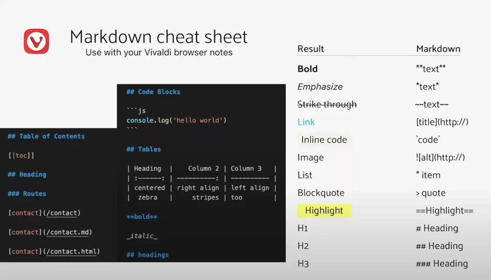

# NodeJS + Vitepress 搭建 Markdown静态网页文档服务器

*   10/02/2022
*   [NodeJS](https://www.chaosparks.com/category/tech/nodejs/), [Markdown](https://www.chaosparks.com/category/markdown/)

## 内容概要

*   [VitePress安装设置](#vitepress安装设置)
*   [VitePress 博客初步配置](#vitepress博客配置)
*   [VitePress博客增强](#vitepress博客)
    *   [\+ 本地搜索](#本地搜索)
    *   [\+ Google Analysis](#a)
    *   [\+ 分类、标签、面包板导航、页面内摘要](#分类)
    *   [\+ 博文设置](#博文)
*   [Prepare markdown content for blog](#p)
*   [Markdown 常用语法](#markdown-常用语法)
    *   [markdown newline](#markdown-newline)
    *   [markdown table with text align](#markdown-table-with-text-align)
    *   [markdown table of content](#markdown-table-of-content)
    *   [markdown image](#markdown-image)
    *   [markdown link](#markdown-link)
*   [参考](#参考)

## VitePress安装设置

在安装 VitePress之前，请确保NodeJS已经安装好，若没有安装好，请看[NodeJS安装指南](/tech/nodejs/node-js-express-setup-web-server/)。

[https://github.com/chaosparks/vitepress-blog-starter](https://github.com/chaosparks/vitepress-blog-starter) 这里包含了一个VitePress 静态站点的模板，方便直接上手使用，无需下面的安装和配置！

1、首先，我们要做的第一件事就是创建博客目录

```js
mkdir blog-vitepress
cd blog-vitepress
```


2、安装 viteppress，具体流程查看 [VitePress官网](https://vitepress.dev/guide/getting-started) ，技术更新迭代较快，以官方为准。

```js
npm add -D vitepress@next
```


3、VitePress 设置

```js
npx vitepress init
```


执行上面的命令，它会问你几个问题，按照如下进行设置，或者选择默认设置即可。

```js
┌  Welcome to VitePress!
│
◇  Where should VitePress initialize the config?
│  ./docs
│
◇  Where should VitePress look for your markdown files?
│  ./docs
│
◇  Site title:
│  My Awesome Project
│
◇  Site description:
│  A VitePress Site
│
◇  Theme:
│  Default Theme
│
◇  Use TypeScript for config and theme files?
│  Yes
│
◇  Add VitePress npm scripts to package.json?
│  Yes
│
◇  Add a prefix for VitePress npm scripts?
│  Yes
│
◇  Prefix for VitePress npm scripts:
│  docs
│
└  Done! Now run npm run docs:dev and start writing.
```


4、启动项目

```js
npm run docs:dev
```


浏览器会打开一个新页面（[http://localhost:3000/](http://localhost:3000/)），到这里，最基本的项目搭建好了。

现在就可以开始 书写markdown文件来 填充博客内容了。待内容搭建好了之后，可以构建静态网站，然后部署到服务器上去。

## VitePress 博客初步配置

1、去掉右侧的边栏

```js
---
aside: false
---
```


2、显示内容章节标题以及子标题

```js
---
outline: [2,3]
---
```


3、自定义 前一页 和 下一页 的链接和文字

```js
---
prev:
  text: Some text here
  link: /myblog/hello_1.md
next:
  text: Some new text here
  link: /myblog/john_1.md
---
```


更多有关 vitepress 站点设置的相关内容，请参考其[官方文档](https://vitepress.dev/zh/reference/site-config)。

## VitePress博客增强

完成了上面的初步设置之后，你就得到了一个简单的静态博客站点。在docs目录下写上几篇 .md文章，在某个页面 、\[header bar\], \[side bar\] 加入文章的link就可以查看文章内容了。

然而，静态站点作为一种电子媒体，它应该有更好的用户体验：例如 检索、分类、标签、面包板导航链接。这样可以方便我们从某个角度（类别、标签）、某个点（关键字搜索）来访问连接，而非单一的访问连接，就如同纸质的书本一样。

为了方便使用，我把 这些功能都整理到了Github上 [VitePress-Blog-Starter](https://github.com/chaosparks/vitepress-blog-starter) 仓库里，方便直接下载和使用，不需要再次进行这些繁琐的配置了。

### \+ 本地搜索

在 `.vitepress\config.mts` 文件中加入如下配置内容

  ```js
  themeConfig: {

    search: {
      provider: 'local',
      options: {
        translations: {
          button: {
            buttonText: 'Search',
            buttonAriaLabel: 'Search Document'
          },
          modal: {
            noResultsText: 'Find Nothing',
            resetButtonTitle: 'Clear Results',
            footer: {
              selectText: 'Select',
              navigateText: 'Switch',
              closeText: 'Close'
            }
          }
        }
      }
    },

```


### \+ Google Analysis

`.vitepress\config.mts` 中加入如下配置内容：

```js
export default defineConfig({
  title: "My Awesome Project",
  description: "A VitePress Site",
  head: [
    [
      'script',
      { async: '', src: 'https://www.googletagmanager.com/gtag/js?id=[YOU_GA_ID]' }
    ],
    [
      'script',
      {},
      `window.dataLayer = window.dataLayer || [];
      function gtag(){dataLayer.push(arguments);}
      gtag('js', new Date());
      gtag('config', '[YOU_GA_ID]');`
    ]
  ], 
``` 


### \+ 分类、标签、面包板导航、页面内摘要

这几个功能牵涉到页面内容修改，需要用到自定义组件。它包含了html/js代码内容，这些代码内容较多就不贴出来，具体可以查看 **[vitepress-blog-starter](https://github.com/chaosparks/vitepress-blog-starter)**

### \+ 博文设置

```js
---
title: How to depoly vitepress blog to vercel
date: 2025-10-17 12:01:01
category: web
tags:
  - html
  - nextjs
breadcrumb: false
next:
  text: 'Depoly vitepress to cloudflare'
  link: '/static-site-with-vitepress/how-to-depoly-vitepress-to-cf'
---

# How to depoly vitepress blog to vercel

To depoly ... 
``` 


`category`, `tags` 设置博文的分类和标签， `breadcrumb` 设置是否显示顶部的导航链接！

## Prepare markdown content for blog

[Html2Markdown Saver](https://www.chaosparks.com/markdown/html2markdown-saver/) will do the work for you. This will help you convert some HTML page element into markdown content if you want to make or copy or interest on some article point. This is not encourage you copy other’s content, but make a solid understand and go deeper along the way.

## Markdown 常用语法



### markdown newline

you can use enter a new space line, or you can use `<br />` in your markdown content.

### markdown table with text align

```js
| Heading | Column 2 | Column 3| 
| :----_: | -------: | ------- |
| centered | right align | left align |
| zebar | strips | me too |
```


### markdown table of content

```js
[[toc]]
```


### markdown image

```js


// usage

```


### markdown link

```js
[title](https://)

// usage
[title](/myblog/mypost1.md)
```
